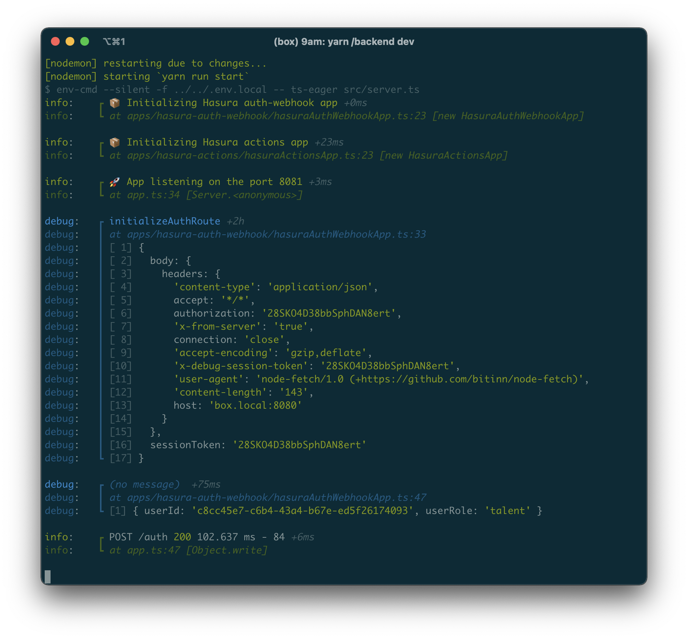

# winston-dev-console

A Winston@3 console format for development (based on [winston-console-format](https://github.com/duccio/winston-console-format)) that aims to improve NodeJS development UX by
* adding the source of the logging statement to the log output
* optimizing readability of each log statement through log statement separation, output colorization and arg pretty printing
   

## Demo


### Real world screenshot:



## Install

```bash
npm install winston @epegzz/winston-dev-console
```

or

```bash
yarn add winston @epegzz/winston-dev-console
```
<br>

## Usage TypeScript

```typescript
import { createLogger, format, transports } from "winston";
import winstonDevConsole from "@epegzz/winston-dev-console";
import util from "util";

let log = createLogger({
  level: "silly", // or use process.env.LOG_LEVEL
});

// Note: You probably only want to use winstonDevConsole during development
log = winstonDevConsole.init(log);
log.add(
  winstonDevConsole.transport({
    showTimestamps: false,
    addLineSeparation: true,
  })
);

log.silly("Logging initialized");
log.debug("Debug an object", { make: "Ford", model: "Mustang", year: 1969 });
log.verbose("Returned value", { value: util.format });
log.info("Information", {
  options: ["Lorem ipsum", "dolor sit amet"],
  values: ["Donec augue eros, ultrices."],
});
log.warn("Warning");
log.error(new Error("Unexpected error"));
```

## Usage JavaScript

```js
const { createLogger, format, transports } = require("winston");
const winstonDevConsole = require("@epegzz/winston-dev-console").default;
const util = require("util");

let log = createLogger({
  level: "silly", // or use process.env.LOG_LEVEL
});

// Note: You probably only want to use winstonDevConsole during development
log = winstonDevConsole.init(log);
log.add(
  winstonDevConsole.transport({
    showTimestamps: false,
    addLineSeparation: true,
  })
);

log.silly("Logging initialized");
log.debug("Debug an object", { make: "Ford", model: "Mustang", year: 1969 });
log.verbose("Returned value", { value: util.format });
log.info("Information", {
  options: ["Lorem ipsum", "dolor sit amet"],
  values: ["Donec augue eros, ultrices."],
});
log.warn("Warning");
log.error(new Error("Unexpected error"));
```

## API

## winstonDevConsole.format(options)

### options

Configuration object.<br><br>Type: `DevConsoleFormatOptions`

### options.inspectOptions

`util.inspect()` [configuration object](https://nodejs.org/api/util.html#util_util_inspect_object_options).<br><br> Type: `Object`<br> 

### options.basePath

Used to remove the base path of the project when showing the file path of the log statement.
By default anything in the path before (and including) the `src` folder will be removed.
<br><br>
Type: `String`<br>

### options.addLineSeparation

Wheather or not to separate each log statement with a blank line.
<br><br>
Type: `Boolean`<br>
Default: `true`<br>

### options.showTimestamps

Wheather or not to show timestamps<br>
During development the timestamps are usually more noise then helpful, therefore disabled by default.
<br><br>
Type: `Boolean`<br>
Default: `false`<br>


## Acknowledgements

This project is inspired by and partly shamelessly copied from [winston-console-format](https://github.com/duccio/winston-console-format)